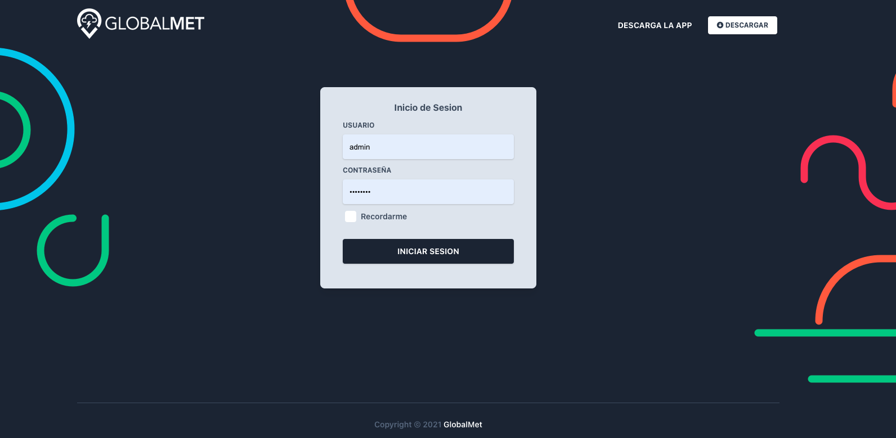
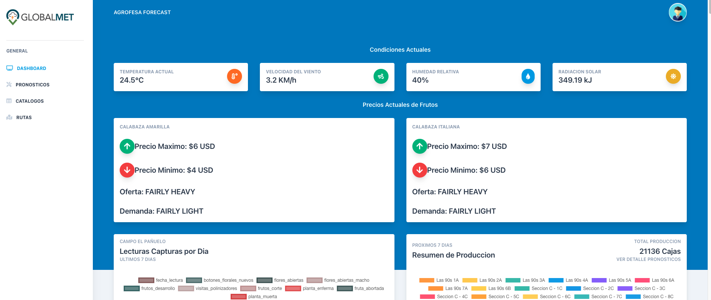

<!-- TODO: Update with your values. -->
# Documentacion Dashboard Forecast Agrofesa
> Documentacion de Usuario

<!-- TODO: You can delete the About and Create a Docsify site sections if you create a new project from this template -->

## Primeros Pasos

El dashboard o Panel de control del Forecast de Agrofesa tiene como fin brindarle la informacion necesaria acerca de los campos y las proyecciones de produccion de los mismos. 

El primer paso es iniciar sesion en la siquiente liga <a href="https://forecast-front.pages.dev">Forecast Agrofesa</a>.

Aqui lo primero que veremos sera el formulario de inicio de sesion donde ingresara su usuario y contraseña, de no contar con uno aun favor de solicitarlo al correo `jeroguzman@gmail.com`.

        

## Dashboard
> Despues de iniciar sesion veremos el dashboard y sus diferentes modulos.

        

En la pantalla de inicio veremos datos de interes como lo son las condiciones actuales del campo, Precios actuales de los frutos, detalle de capturas por dia, Grafica de capturas en campo semanal y Resumen de la proyeccion de produccion.

 

1. Condiciones Actuales. Nos muestra Temperatura Actual, Velocidad del viento, Humedad y Radiacion Solar hasta el momento y se actualiza cada 10 segundos desde el servidor de Globalmet.

2. Precios Actuales de Frutos. Aqui podemos ver precio maximo y minimo por fruto, y la oferta y demanda en el mercado americano. Esta Informacion se actualiza diariamente.

3. Lecturas Capturas Por Dia. Podemos ver en esta seccion en tiempo real las lecturas que se estan realizando en campo por variable capturada. Las mismas se actualizan al instante.

4. Resumen de Produccion. Nos muestra el resumen de proyeccion de la produccion para los proximos 8 dias. Dividido por lotes y plantaciones. Esta informacion se actualiza diariamente.

5. Detalle de Lecturas Capturadas. Aqui vemos la misma informacion del punto 3 pero mas a detalle. Asi como el punto 3 se actualiza al instante. 

## Graficas

Proximamente

## Pronosticos

Pendiente

## Proyeccion vs Produccion

Proximamente
